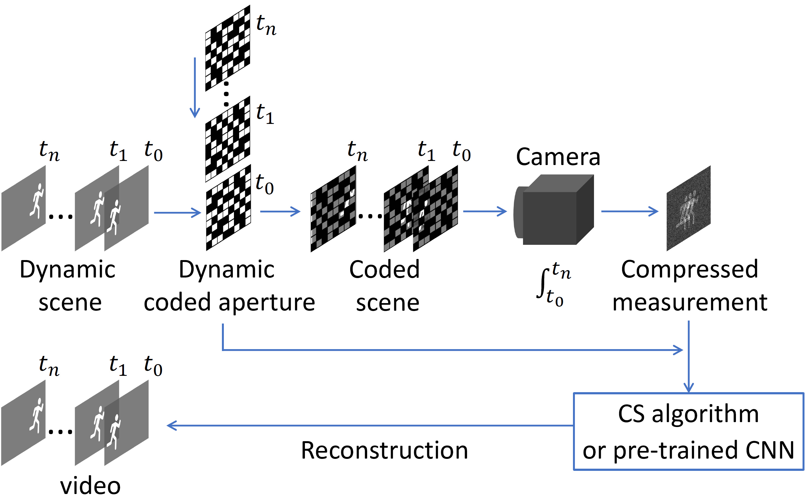
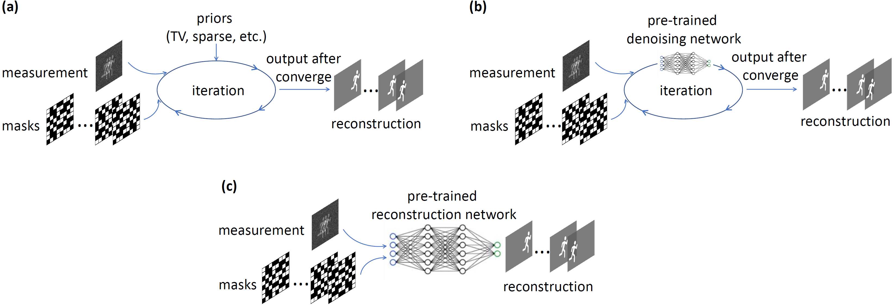

# Deep Learning for Video Compressive Sensing
This repository contains the codes for paper **Deep Learning for Video Compressive Sensing** (***APL Photonics 5, 030801 (2020)***) by Mu Qiao*, Ziyi Meng*, Jiawei Ma, [Xin Yuan](https://www.bell-labs.com/usr/x.yuan) (*Equal contributions).
[[pdf]](https://aip.scitation.org/doi/pdf/10.1063/1.5140721?download=true) [[doi]](https://aip.scitation.org/doi/10.1063/1.5140721) 

## Introduction
Snapshot compressive sensing imaging (SCI) techniques aim to capture high-dimensional (>=3) data using low-dimensional detectors in a snapshot fashion, which drmatically increase the capturing speed and meanwhile reduce the storage/bandwidth requirements. As an example, video SCI captures multiple frames of a video (or dynamic scene) with a single frame coded measurement (see Figure 1). Reconstruction algorithms are then followed to recover the video by solving an ill-posed inverse problem, given the compressed measurement, the coding pattern (or the forword model) as well as some priors on the video.

We compare two iteration-based reconstruction algorithms, [GAP-TV](https://ieeexplore.ieee.org/abstract/document/7532817) and [DeSCI](https://ieeexplore.ieee.org/abstract/document/8481592), with two deep-leaning-based algorithms, [PnP-FFDNet](https://arxiv.org/pdf/1710.04026.pdf) and End-to-End convolutional neural network (E2E-CNN), for video SCI (see Figure 2).

<p align="center">

</p>

Figure 1. Principle of video compressive sensing imaging (SCI). A dynamic scene, shown as a sequence of images with different timestamps (t_1, t_2, ..., t_B, top-left), passes through a dynamic coding aperture which imposes distinguishing random spatial coding on each frame of the scene in a elementwise manner. The coded frames after the aperture are then integrated within a single exposure of a camera, forming a single-frame compressed measurement (top-right). Iterative algorithms or pre-trained neural networks are then employed to reconstruct the time series (bottom-left) of the dynamic scene from the measurement and the coding patterns.


<p align="center">

</p>

Figure 2. Three frameworks for video SCI reconstruction. (a) Iteration-based algorithms using preset priors (e.g., TV or sparsity). (b) Iteration-based algorithms using deep denoising priors, which have proven to provide faster iteration as well as better image quality than (a). (c) End-to-End convolutional neural network (E2E-CNN) based algorithms which use a single frame measurement as the input to directly generate a multi-frame video output through a pre-trained network. Due to the end-to-end scheme, (c) is dramatically faster than the iteration-based algorithms. However, because the network is trained for specific system parameters including image size, compression ratio and coding patterns, (c) is less flexibile than (b) where the pre-trained deep denoiser is independent of system parameters.


<p align="center">

</p>

Figure 3. Reconstruction of [water balloon falling and bouncing](https://aip.scitation.org/doi/figure/10.1063/1.5140721@app.2020.PHAI2020.issue-1#v2) with different algorithms from measurements of different compression ratios (Cr). Higer Cr provides more fluent vidoes but at the price of image quality. Only Cr=10, 20 and 30 are shown for E2E-CNN due to limited GPU memory. All images are of size 512×512 pixels. Running times for different algorithms are listed in the [paper](https://aip.scitation.org/doi/pdf/10.1063/1.5140721?download=true). More results are available at [pendulum ball](https://aip.scitation.org/doi/figure/10.1063/1.5140721@app.2020.PHAI2020.issue-1#v3) and [domino](https://aip.scitation.org/doi/figure/10.1063/1.5140721@app.2020.PHAI2020.issue-1#v1).


## Usage
### Download the DL-CACTI repository
via
```
git clone https://github.com/mq0829/DL-CACTI
```
or download the [zip file](https://github.com/mq0829/DL-CACTI/archive/master.zip) manually.

### Test a reconstruction algorithm (GAPTV, DeSCI, PnP or E2ECNN)
0. Open a test code (e.g., test_GAPTV) 
0. Specify a compressed measurement in the `dataset` file to be reconstructed (`meas_waterBalloon_cr_10.mat` by default) 
1. Run the test code to start the reconstruction
2. Wait until the results pop up


## Structure of directories

| directory  | description  |
| :--------: | :----------- | 
| `test_GAPTV.m`              | Run GAPTV algorithm on video SCI | 
| `test_DeSCI.m`              | Run DeSCI algorithm on video SCI |
| `test_PnP_with_FFDNet.m`    | Run PnP algorithm on video SCI  |
| `test_E2ECNN.py`            | Test the pretrained CNN network for video SCI reconstruction |
| `test_FFDNet_denoising.m`   | Denoise the reconstructed video from e.g. GAPTV using FFDNet denoiser |
| `DeSCI_algorithm`           | DeSCI algorithm functions used by the test code |
| `GAP_TV_algorithm`          | GAP_TV algorithm functions used by the test code |
| `PnP_algorithm`             | PnP algorithm functions used by the test code |
| `dataset`                   | Data (measurements and masks) used by the test code |
| `Images`                    | Images shown in this webpage |


## Platform
The test platform is MATLAB(R) 2017b for DeSCI, 2018a for GAPTV and PnP, and Tensorflow for E2E_CNN on Windows 10 (x64) with an Intel(R) Core(TM) 12-core processor at 2.8 GHz and 64 GB RAM.


## Citation
```
@article{qiao2020deep,
  title={Deep learning for video compressive sensing},
  author={Qiao, Mu and Meng, Ziyi and Ma, Jiawei and Yuan, Xin},
  journal={APL Photonics},
  volume={5},
  number={3},
  pages={030801},
  year={2020},
  publisher={AIP Publishing LLC}
}
```


## Contact
[Mu Qiao, New Jersey Institute of Technology](mailto:muqiao@njit.edu "Mu Qiao, New Jersey Institute of Technology") 

[Ziyi Meng, Beijing University of Posts and Telecommunications](mailto:zm233@njit.edu "Ziyi Meng, Beijing University of Posts and Telecommunications") 

[Jiawei Ma, Columbia University](mailto:jiawei.m@columbia.edu  "Jiawei Ma, Columbia University") 

[Xin Yuan, Bell Labs](mailto:xyuan@bell-labs.com "Xin Yuan, Bell labs")  


